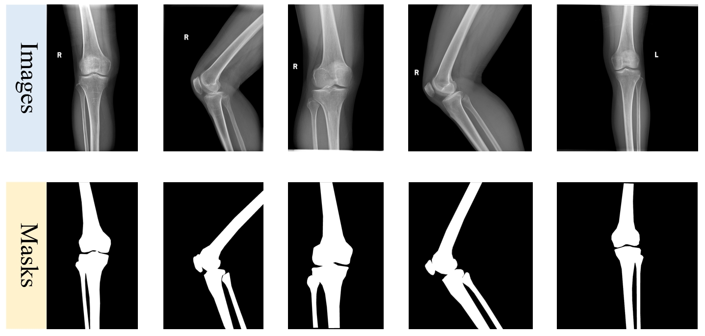

# Knee2024
The Knee2024 benchmark dataset for medical image segmentation

> To support testing and research endeavors, we offer an extensive collection of over 50 data samples, encompassing both images and corresponding masks. This meticulously prepared data is organized into dedicated folders for images and masks, ensuring easy access. Importantly, we have rigorously desensitized all data, removing any information that could potentially disclose patient identities, such as names, ID numbers, medical record numbers, etc., to uphold privacy standards.

Here we provide sample data.

> We are committed to releasing a more extensive collection of meticulously curated and thoroughly annotated training images, along with their associated data, to the public. This initiative aims to enrich the pool of resources available to researchers and developers, offering a broader and more varied foundation for training and evaluating their machine learning models. Such an endeavor is expected to significantly contribute to the advancement and innovation within related disciplines.
